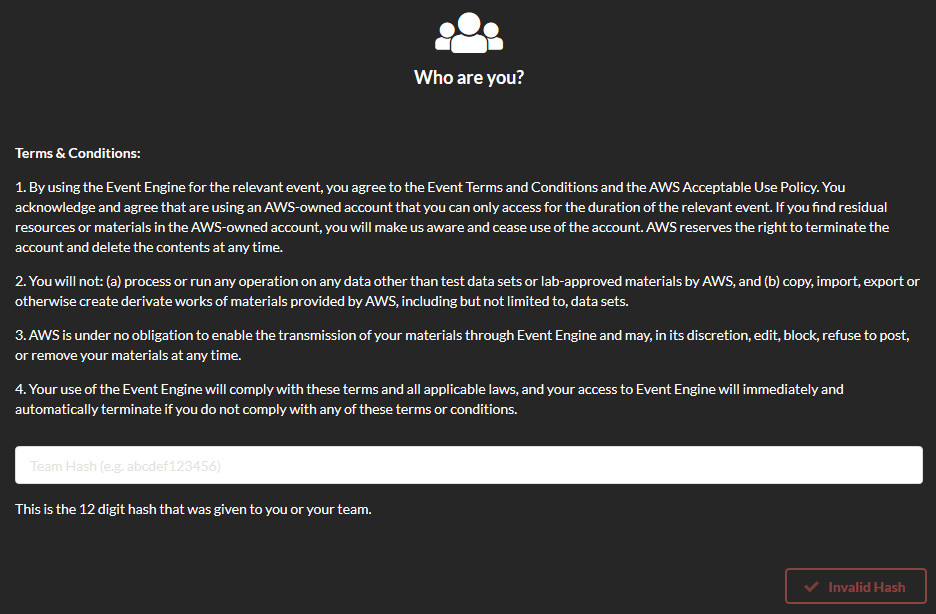

# Sagemaker Processing Workshop

In the previous workshop we have set up Sagemaker Pipelines for working with Abalone dataset. We used processing step for data transformation and Model Evaluation. In this workshop, we will take a closer look at Sagemaker processing and what we can do with it. 

# Getting Started

One way to interact with the AWS platform is by using the [AWS Management Console](https://aws.amazon.com/console/). This intuitive, web-based console allows you to administer all of your AWS resources in a single interface.

## Log In

We will be using AWS Event Engine for the labs in order to prevent you from incurring any expense.

To access the AWS Event Engine Team Dashboard, [open this link in a new tab](https://dashboard.eventengine.run/).

Once the Event has begun, find your name below and enter the 12 digit hash (next to your name) in the Team Dashboard.

From within the Team Dashboard, click on "AWS Console" and then "Open AWS Console". This will open the console in a new tab for you to begin your labs.

!!! warning "IMPORTANT"
    Each attendee will have their own, unique AWS account to perform the labs. Make sure you find your name in the list and only use ** your** hash.  If you don't see your name in the table, please let us know.

| Name              | AWS Event Engine Hash |
| ----------------- | ---------------------- |
| William McCullough| c187-069c8ab404-02 |
| Extra-1| 754e-0ed349c164-3d |
| Joshua Mann| 6653-0092e53794-21 |
| Brad Harris| 551f-0a061820a4-ac |
| Extra-2| f949-066fa77424-db |
| Karen Cheng| a7f4-074c2a74b4-f7 |
| Amanda Gentzel| 9b97-053c712384-06 |
| Caleb Johnson| fab0-003420c1d4-d5 |
| Issac Weaver| 7259-0c932d8fd4-9d |
| Paul Roysdon| 84bc-07dff48a94-a8 |
| Tifani O'Brien| 31f8-0c3beaf664-3a |
| Gavin Black| 2ed1-0c45527904-3a |
| Christoph Michael| f125-01915317b4-5a |
| Mack Blackburn| bc84-0fe7955bd4-e4 |
| Robert Allen| 37f7-07355c5c44-4c |
| Jack Linkous| a84e-0ea1a64674-15 |
| Vilas Tulachan| fc36-0743dfa884-60 |

!!! info
    These accounts will be available for you to use until close of business on **07/01/2021**

## Verify Region

For this class, we will be doing all of our work out of the **us-east-1 (N. Virgina)** region. To verify you're using the correct region, the region dropdown at the top right of the screen should read _N. Virginia_.

## Browser

We recommend you use the latest version of Chrome or Firefox to complete this workshop.

## Next Steps

Now that you're logged in to the console (and have the appropriate region selected!!), let's jump in. If you're new to AWS, we recommend taking a look at the [AWS Overview](overview.md) as a primer.

## Lab 0: Starting Amazon SageMaker Studio

<!--
  
-->

### Beginning the Lab

First we are going to start a SageMaker Studio instance. 

1. From your AWS Console, Type sagemaker in the search bar and then select Select Amazon SageMaker.

2. Next Select **Amazon SageMaker Studio** from the SageMaker Console

3. Select **Quick Start** and then Click the dropdown for **Execution Role**. Here we allow SageMaker to be able to access any S3 buckets we create 

4. Select **Create a new role**

5. Ensure the permissions look like the picture and click **Create Role**

6. Verify that the Role was creaed successfully and then click **Submit**

7. Your SageMaker Studio environment is now being created (takes 10-15 minutes)

8. Once the SageMaker Studio environment has been created, click on **Open Studio**

9. Wait until the SageMaker Studio environment has finished loading (5-10 mins)

??? optional-class "Jupyter notebook instructions (expand for details)"
	- Jupyter notebooks tell a story by combining explanatory text and code. There are two types of "cells" in a notebook:  code cells, and "markdown" cells with explanatory text.  
	- You will be running the code cells.  These are distinguished by having "In" or "[ ]" next to them in the left margin next to the cell, and a greyish background.  Markdown cells lack "In" or "[ ]" and have a blank background.
	- To run a code cell, simply click in it, then either click the **Play** arrow button in the notebook's toolbar, or use Control+Enter on Windows (Shift+Enter on Mac) from your computer's keyboard.  
	- It may take a few seconds to a few minutes for a code cell to run (an asterick will appear in "[ ]" when running and will change to a number once execution has completed).  Please run each code cell in order, and only once, to avoid repeated operations.  For example, running the same training job cell twice might create two training jobs, possibly exceeding your service limits.

## Previous Workshop 

### Pipelines set up
In this section of the workshop, we will look at the mechanics of setting up a pipeline with steps from loading data, preprocessing, building and training a model, evaluating and registering and performing batch inference on Sagemaker Studio

### Pipelines Event Trigger with S3 upload

We will use the previously deployed pipeline and trigger it automatically when a new data file is uploaded using AWS Lambda, Amazon S3 and Sagemaker Python SDK.
